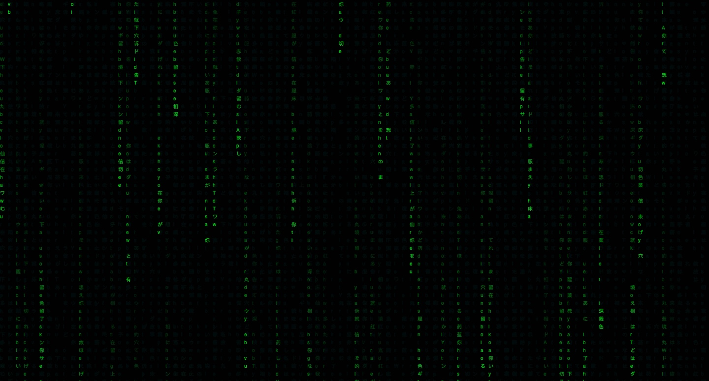

# Online Arcade

## Overview

1. [Description](#description)
2. [Deployment Link](#deployment-link)
3. [Installation](#installation)
4. [Technologies Used](#technologies)
5. [Deliverables](#deliverables)
6. [Planning/Build Process](#planning)
7. [Challenges](#challenges)
8. [Wins](#wins)
9. [Key Learnings & Takeaways](#takeaways)
10. [Future Improvements](#future-improvements)

---

##  1. Description

Collection of links to some browser games I created.

##  2. Deployment link

https://arcade.katieloesch.co.uk/

##  3. Installation

No installations are required to run this application. The only tools needed are a web browser with JavaScript support and internet connectivity.

##  4. Technologies Used

- This application is based in JavaScript, CSS and HTML.

### UI

- fonts:
  - 'Mitr' designed by Cadson Demak
    - source: Font Squirrel
      - https://www.fontsquirrel.com/fonts/mitr
    - also available from Google Fonts:
      - https://fonts.google.com/specimen/Mitr
    - .woff files: assets/fonts directory
- icons:
  - iconify
    - https://icon-sets.iconify.design/
  - fontawesome
    - https://fontawesome.com/
- images

### Additional tools used:

- Git / GitHub
  - used for version control
  - https://git-scm.com/
  - https://github.com/
- Visual Studio Code (VSCode)
  - code editor used for writing CSS, JSX and JavaScript
- Google Chrome browser
  - used for launching the website and displaying the application Google Chrome
- Google Chrome Developer Tools: For troubleshooting and debugging
  - https://www.google.com/intl/en_uk/chrome/
- Hostinger: provider used to host the game online
  - https://www.hostinger.co.uk
- Excalidraw
  - used for building the wireframe
  - https://excalidraw.com/
- chatGTP

### Resources and tutorials:

- matrix effect canvas:
  - [Hacking Matrix Rain Effect using HTML CSS & JavaScript](https://www.youtube.com/watch?v=uIq9gmlenlA&list=PL5TCQHRtvHGkuR2YZDf_2lDFuc9m5OUlO&index=22) by [CodeCreative](https://www.youtube.com/@CodeCreativeYT)
  - [Matrix raining code effect using HTML, CSS and Javascript](https://www.youtube.com/watch?v=y4K_5CVz7Cs&list=PL5TCQHRtvHGkuR2YZDf_2lDFuc9m5OUlO&index=21) by [JavaScript Academy](https://www.youtube.com/@JsAcademyOfficial)

##  5. Deliverables

### MVP

- a git repository hosted on Github, including:

  - a link to the hosted game
  - frequent commits dating back to the very beginning of the project
  - code that is well-formatted and well-commented
  - semantic markup for HTML and CSS while adhering to best practices
  - adherence to KISS (Keep It Simple Stupid) and DRY (Don't Repeat Yourself) principles

- a website with the following features:

  - links to browser games
  - links to contact information -> email, GitHub, LinkedIn and other relevant links
  - have a mobile-responsive design

### Stretch Goals

- animations
- sound effects

## 6. Planning / Build Process

This was a solo project I built over the course of '' days.

### User Stories

- As a user, I should be able to navigate the website without effort.
- As a user, I should be able to find links to different online games easily.
- As a user, I should be able to quickly find the developer's contact information including email, LinkedIn and GitHub accounts.
- As a user, I should be able to navigate the website from any device.

### Day 1 - 03/02/2024

I started this project by setting up the basic folder structure and creating html/CSS/JS files.

I also created a wireframe on Excalidraw to get an idea of the basic layout of the website.

I wanted the background to look like the matrix effect so I created a canvas element and some JS code for the animation.

### Day 2 - 23/01/2024

## 7.  Challenges

## 8.  Wins

- matrix effect backdrop didn't take a lot of time to create and I was please with the result.

##  9. Key Learnings & Takeaways

##  10. Future Improvements
